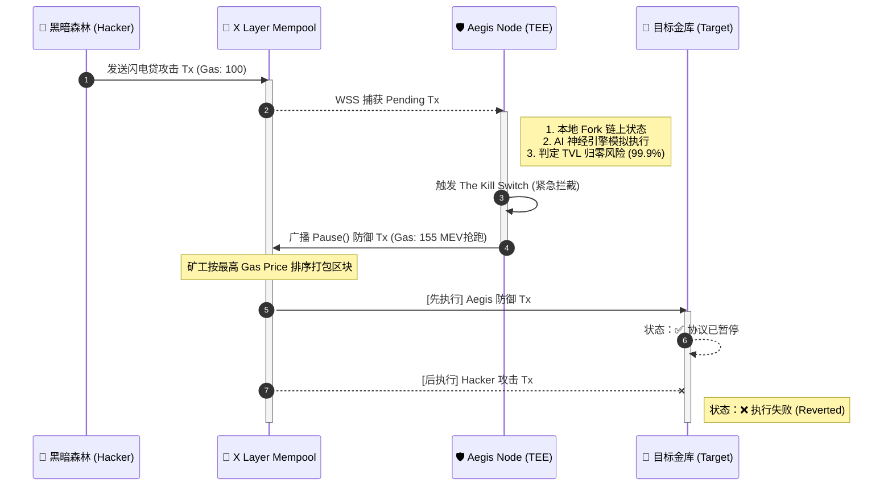

# Aegis-Matrix (神盾矩阵) 🛡️
**基于 OKX Onchain OS 的自愈型智能合约免疫与抢跑拦截系统**

## 1. 架构概述
Aegis-Matrix 并非传统的静态代码审计工具，而是一个部署在 Onchain OS 节点层的动态免疫系统。它通过 WebSocket 持续监听 Mempool (内存池) 中的 Pending 交易。当检测到与受保护金库的交互时，引擎会在本地 Fork 链上状态并进行毫秒级模拟执行。
如果大模型神经引擎判定该执行轨迹将导致严重的 TVL 流失（如零日漏洞攻击），系统将自动构建 `pause()` 交易，并以黑客 1.5 倍的 Gas Price 抢先打包，实现物理级拦截。

## 2. 核心模块
* **Mempool Scanner:** 基于 `web3.py` 的异步 WSS 订阅，捕获未确认交易。
* **Neuro-Symbolic Engine:** 本地状态模拟 (Dry-run) 结合大模型推理，识别恶意资金抽离。
* **Front-Running Executor:** MEV 级抢跑发单器，确保防御补丁先于攻击交易落地。

## 3. 快速复现指南 (Windows 环境)

### 步骤 A: 环境准备
1. 克隆仓库：`git clone https://github.com/hkka1/Aegis-Matrix.git`
2. 进入目录：`cd aegis-matrix`
3. 安装依赖：`pip install -r requirements.txt`
4. 复制并配置 `.env` 文件，填入你的 OKX X Layer WSS 节点地址和测试钱包私钥。

### 步骤 B: 启动攻防演练靶场
打开终端 1，启动 Aegis 防御节点：

🔒 TEE 硬件级私钥黑盒 (Intel SGX / AWS Nitro): > Aegis-Matrix 的核心签名模块运行在 TEE（可信执行环境）中。Agent 的私钥在芯片级内存中生成并隔离，甚至连部署该节点的物理机管理员也无法获取私钥。AI 大模型只有在判定“攻击成立”时，才能触发 TEE 内部的唯一一次 ECDSA 签名。彻底杜绝“哨兵变节”风险。

💎 商业闭环：Save-to-Earn (救援即收益)
Aegis-Matrix 不是一个做慈善的公共组件，而是一个具有自驱力的自主经济实体 (AEE)。当拦截成功并挽救协议 TVL 后，Aegis 智能合约将自动提取 1% 的防守资金作为“白帽救援费”。Agent 赚取的利润将用于自动购买更多的 OKX X Layer RPC 节点算力和更高维度的 AI API，实现真正的**“以战养战，自我进化”**。
```bat
.\scripts\windows_start_node.bat
```

### 4. 核心攻防流转图 (Aegis-Matrix Architecture)


